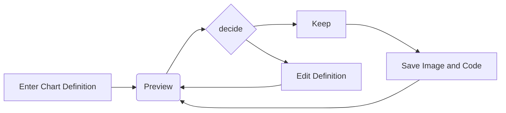

<!-- Begin section: Overview -->

[//]: # (https://raw.githubusercontent.com/jehna/readme-best-practices/master/sample-logo.png&#41;)

[//]: # (![Logo of the project]&#40;https://raw.githubusercontent.com/RyanBalshaw/sjmelck_pages/main/robot_logo.svg&#41;)

# Sjmelck
> Sjmelck just means engineers love computers, k?

<br/>


The purpose of [Sjmelck](https://ryanbalshaw.github.io/sjmelck_pages/) is to provide an awesome blog for content related to engineering, computing, and everything in-between.

## Installing / Getting started

A quick introduction of the minimal setup you need to get a blog post up and running. As a first step, please make sure the following packages are installed:
1. [Hugo](https://gohugo.io/)
2. [git](https://git-scm.com/)
3. [Poetry](https://python-poetry.org/)

Once these have been installed, you are welcome to run the following:
```shell
git clone https://github.com/RyanBalshaw/sjmelck_pages.git
cd sjmelck_pages
hugo server # Creates a local version of the website
```

This will clone the repo and open up a local version of the website. Press `Ctrl + C` in the terminal to stop the local server.

## Configuring python and commits
[Poetry](https://python-poetry.org/) is the approach chosen to manage the python environment and setting up the virtual environment is incredibly simple. Once poetry is correctly installed, you can set up the virtual environment by running
```shell
cd sjmelck_pages # If you aren't already within the repo directory. Skip otherwise.
poetry install
```

You can then step into the virtual environment using
```shell
poetry shell
```
to use the packages specified. Poetry is also supported by many IDEs, so you can easily get it incorporated within your IDE of choice.

[Pre-commit]() is set up as the default development approach to linting to improve the readability and eligibility of the repository. Setting up pre-commit is simple (it is included in the pyproject.toml file used for Poetry) and can be done via
```code
pre-commit install -t pre-push
```

This ensures that prior to any changes done to the remote repository, pre-commit hooks are run. The changes will occur in
```code
git add ...
git commit -m "Added changes to repo to solve XXX."
git push # Pre-commit hooks are invoked here.
```

## Creating a blog post

If you wish to create a blog post, it is as simple as navigating to the base directory and running:

```shell
hugo new blog/a-new-blog-post.md
```

This will create a new file in the `contents/blog` directory. You can then open the file with any editor of your choosing.

```
---
title: "A Trial Blog Post"
publishdate: 2023-04-20T16:19:31+02:00
author: dummy-name
description: dummy-description
draft: true
toc: true
tags: ["tag1", "tag2", "tag3"]
categories: ["category1"]
_build:
  list: always
  publishResources: true
  render: always
---
```

This information will be at the start of the file. Please change the information as necessary. Importantly, if you wish to push your blog post to the main branch you will need to change `draft: false` to `draft: true`. You can then add [markdown](https://commonmark.org/help/) to the post.

Save the file, then start a local server to view the changes you made.
```shell
hugo server --buildDrafts
hugo server -D
```

View the blog post and make changes as necessary.

## Adding equations in markdown

Adding equations is simple, and [Mathjax]() is used to support any equations. Inline equations can be created using
```markdown
\\( ... \\)
```
and equations can be created using
```markdown
\[ ... \]
```
or
```markdown
$$ ... $$
```

More information can be found [here](https://docs.mathjax.org/en/latest/input/tex/delimiters.html).

## Adding figures
Adding figures is relatively simple, some structure was just set up to ensure that everything is consistent. All python scripts used to generate figures are stored in the `C:\...\sjmelck_pages\assets\images\` directory and the assumption is that one would then create a directory within `\assets\images\` with the exact same name as the blog post of interest and store all figures necessary for the blog post in there.

This enables one to simply place
```markdown

```
in the markdown of the relevant blog to render the figure and all paths to the file are handled internally.

**Note:**
```note
What would be awesome is a way to automatically create a blank python script and folder within assets\images. I am not sure how to do it yet, but it is an open issue.
```

## Adding mermaid diagrams

Please ensure that the `hasMermaid` config is enabled in the post
```markdown
---
title: "My Page with Mermaid Diagrams"
hasMermaid: true
---
```

You can then add diagrams in the markdown files using standard markdown syntax:


## Adding reveal sections

Sections that are clickable with a dropdown to reveal content can be added by including a block of text with the following configuration in the Markdown file:
```markdown


Markdown text! :v:


```

## Contributing

If you'd like to contribute, please fork the repository and use a feature
branch. Pull requests are warmly welcome.

[//]: # (## Links)

[//]: # ()
[//]: # (Even though this information can be found inside the project on machine-readable)

[//]: # (format like in a .json file, it's good to include a summary of most useful)

[//]: # (links to humans using your project. You can include links like:)

[//]: # ()
[//]: # (- Project homepage: https://your.github.com/awesome-project/)

[//]: # (- Repository: https://github.com/your/awesome-project/)

[//]: # (- Issue tracker: https://github.com/your/awesome-project/issues)

[//]: # (  - In case of sensitive bugs like security vulnerabilities, please contact)

[//]: # (    my@email.com directly instead of using issue tracker. We value your effort)

[//]: # (    to improve the security and privacy of this project!)

[//]: # (- Related projects:)

[//]: # (  - Your other project: https://github.com/your/other-project/)

[//]: # (  - Someone else's project: https://github.com/someones/awesome-project/)


## Licensing

The code in this project is licensed under MIT license.

<!-- End section: Overview -->
