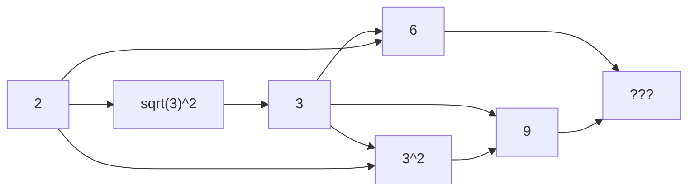

Welcome to the landing page of Douw Marx.

### :beers: Who is Douw Marx?

I am a Mechanical Engineer. I completed my Masters in Mechanical engineering (with distinction) in the field of condition monitoring. I enjoy programming, statistics and math. I am currently working on my PhD under [Prof. Kostis Gryllias](https://scholar.google.fr/citations?user=mAZzvOwAAAAJ&hl=en) at KU Leuven, Belgium. I am working on the [MOIRA project](https://h2020-moira.eu/) as a Marie Sklodowska-Curie fellow. The University of Pretoria is currently undergoing the patenting process for a novel planer mechanism I invented. My creativity is well-balanced with a practical and results-focused side.

### :blue_heart: Fun question

What do you get if you multiply six by nine? 



> :bulb: **42**



