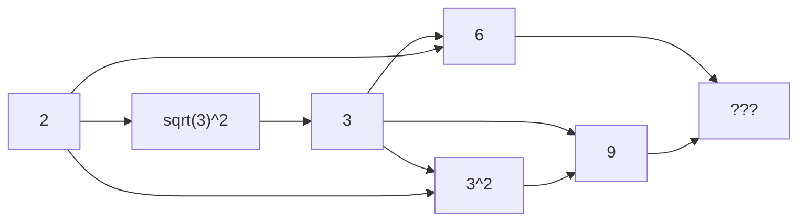

Welcome to the landing page of Johann Bouwer.

### :ramen: Who is Johann Bouwer?

Content loading...

### :heart: Fun question

What do you get if you take the square root of 1764?



> :bulb: **42**



