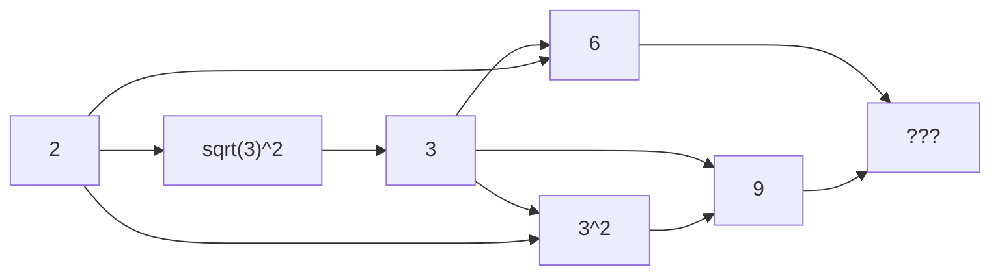

Welcome to the landing page of Justin Smith.

### :dragon: Who is Justin Smith?

I am a post-graduate mechanical engineering student at the University of Pretoria with a passion for condition monitoring and machine learning.

### :green_heart: Fun question

How can you use the ASCII values of the characters in the word "math" to get to the question posed by Ryan Balshaw?



> :bulb: **42**



