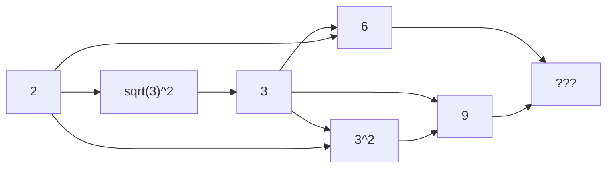

Welcome to the landing page of Ryan Balshaw.

### :chicken: Who is Ryan Balshaw?

Current PhD candidate in Mechanical Engineering at the University of Pretoria, my research is focused on asset condition monitoring using Artificial Intelligence. I am passionate about vibration analysis, machine learning and asset integrity, with a keen interest in signal processing and it’s applications in practice.

### :purple_heart: Fun question

What is the answer to the ultimate question of life, the universe, and everything?



> :bulb: **42**



